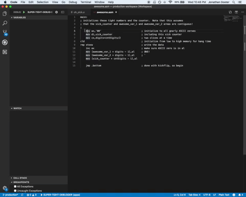
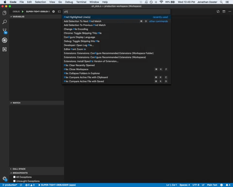
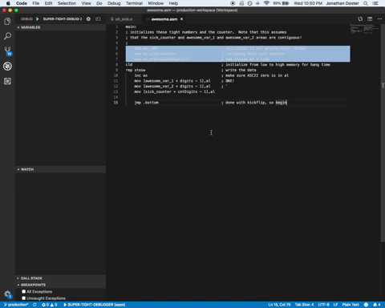

# Visual Studio Code Highlighter Extension

*Commands*

- Highlight Line(s)
- Find Highlight(s)
- Remove Highlighted Line(s)
- Remove All Saved Highlights

# Highlight Line(s)

# Find Highlight(s)

# Remove Highlight(s)

Happy Coding!

[GitHub Issues](https://github.com/jbdoster/highlighter/issues)
